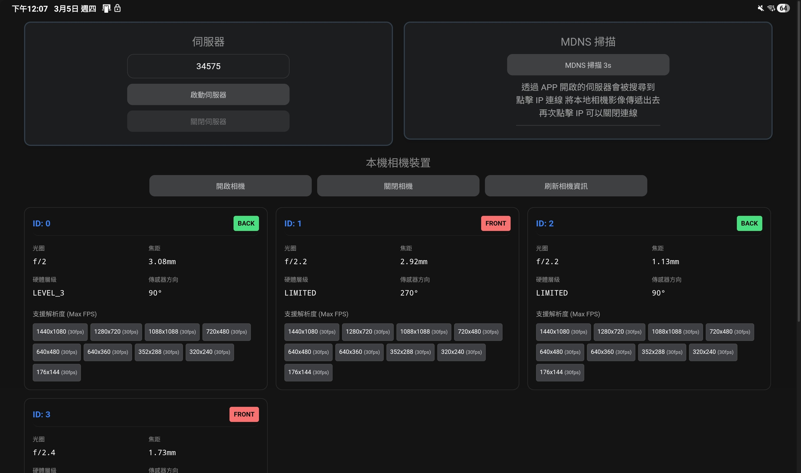

<div align="center">

# 📷 Webcam（Tauri + SolidJS）

把 **Android 手機相機**變成可分享的網路影像來源，  
支援手機與電腦間的串流協作（手機→手機、手機→電腦）。

<p align="center">
   
</p>

</div>

## ✨ Features

- Android 相機串流（目前相機能力以 Android 為主）
- 伺服器可部署在手機或電腦
- mDNS 掃描同網段裝置並建立遠端上傳
- 支援 local / remote 雙來源預覽
- 相機控制：
  - 線性縮放（Linear Zoom）
  - 曝光補償（Exposure Compensation）
  - 手電筒（Torch）
  - 對焦控制（Focus reset / cancel focus）

---

## ⚠️ Platform Support

- 相機功能目前為 **Android-only**（列舉相機、解析度/fps、控制能力）
- 串流伺服器可運行於手機或電腦

使用情境：

- 手機自己開伺服器，直接提供網路串流
- 手機 A 傳給手機 B（B 當承載端）
- 手機傳給電腦，由電腦承載伺服器負載，後續一樣可透過網路觀看影像

---

## 🧭 Routes

| Path | 說明 |
|---|---|
| `/stream/local` | 含控制器的本地來源頁面 |
| `/stream/remote` | 含控制器的遠端來源頁面 |
| `/video/local` | 純影片本地來源頁面 |
| `/video/remote` | 純影片遠端來源頁面 |

- `local`：伺服器所在裝置的「本機相機來源」
- `remote`：其他裝置上傳到此伺服器的「遠端來源」

---

## 🚀 Quick Start（使用者操作手冊）

### 1) 啟動伺服器

1. 開啟 App 後設定 Port（或用預設值）
2. 點擊「啟動伺服器」
3. 從介面中的 IP/網址快捷按鈕打開串流頁面

### 2) 掃描裝置（mDNS）

1. 點擊「MDNS 掃描 3s」
2. 在清單中選擇目標 IP 建立遠端上傳
3. 連線成功後可在 App 看到 remote 狀態

### 3) 開啟相機與選解析度

1. 選擇相機與解析度（不同 Android 機型支援不同）
2. 點「開啟相機」開始提供影像來源
3. 需要時可切換縮放、曝光、手電筒與對焦控制

### 4) 分享與觀看

- 要控制器：使用 `/stream/local`、`/stream/remote`
- 要純畫面：使用 `/video/local`、`/video/remote`

---

## 📦 Installation

Clone repository：

```bash
git clone https://github.com/cck7121-dev/webcam
cd webcam
```

Install dependencies：

```bash
pnpm install
```

---

## 🛠 Development

Run app in development mode：

```bash
pnpm tauri dev
```

Run app in development mode（Android）：

```bash
pnpm tauri android dev
or 
pnpm tauri android run
```

---

## 🏗 Building

Build for production：

```bash
pnpm tauri build
pnpm tauri android build
```

產出會在 `src-tauri/target/release`（依平台可能有對應子目錄）。

---

## 🎛 Camera Notes

- 解析度與 fps 取決於 Android 裝置相機能力
- 影像流程基於 Android 端分析管線（ImageAnalyze / analyzer 取向）
- 提供縮放、曝光、手電筒與對焦控制，方便即時調整串流畫面

---

## 🤝 Contributing

歡迎提交 Issue / PR 來改善功能、修正 bug、或補充文件。

---

## 📄 License

MIT License
